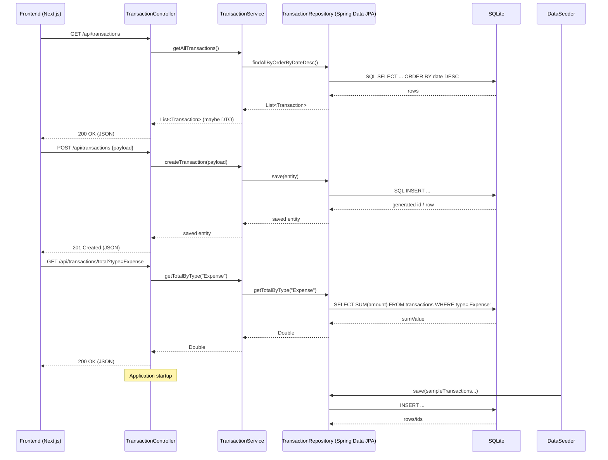

# FinDash Backend - Spring Boot REST API

A RESTful API for the FinDash financial dashboard application, built with Spring Boot, Hibernate ORM, and SQLite database.

## 🚀 Technologies

- **Java 17**
- **Spring Boot 3.2.0**
- **Spring Data JPA** (Hibernate ORM)
- **SQLite** database
- **Maven** build tool
- **Lombok** for reduced boilerplate
- **Bean Validation** for input validation

## 📋 Prerequisites

- Java 17 or higher
- Maven 3.6+

## 🛠️ Setup and Installation

1. **Navigate to the backend directory:**
   ```bash
   cd backend
   ```

2. **Build the project:**
   ```bash
   mvn clean install
   ```

3. **Run the application:**
   ```bash
   mvn spring-boot:run
   ```

   The API will start on `http://localhost:8080`

## 📡 API Endpoints

### Transactions

| Method | Endpoint | Description |
|--------|----------|-------------|
| GET | `/api/transactions` | Get all transactions (ordered by date desc) |
| GET | `/api/transactions/{id}` | Get transaction by ID |
| POST | `/api/transactions` | Create new transaction |
| PUT | `/api/transactions/{id}` | Update transaction |
| DELETE | `/api/transactions/{id}` | Delete transaction |
| GET | `/api/transactions/type/{type}` | Get transactions by type (Income/Expense) |
| GET | `/api/transactions/category/{category}` | Get transactions by category |
| GET | `/api/transactions/date-range?startDate=YYYY-MM-DD&endDate=YYYY-MM-DD` | Get transactions by date range |
| GET | `/api/transactions/summary` | Get financial summary (income, expense, balance) |

### Request/Response Examples

**Create Transaction (POST /api/transactions):**
```json
{
  "date": "2025-10-26",
  "description": "Groceries",
  "category": "Food & Dining",
  "merchant": "Whole Foods",
  "amount": 250.00,
  "type": "Expense",
  "paymentMethod": "Credit Card",
  "notes": "Weekly grocery shopping"
}
```

**Response:**
```json
{
  "id": 1,
  "date": "2025-10-26",
  "description": "Groceries",
  "category": "Food & Dining",
  "merchant": "Whole Foods",
  "amount": 250.00,
  "type": "Expense",
  "paymentMethod": "Credit Card",
  "notes": "Weekly grocery shopping",
  "createdAt": "2025-10-26",
  "updatedAt": "2025-10-26"
}
```

**Get Summary (GET /api/transactions/summary):**
```json
{
  "totalIncome": 5000.00,
  "totalExpense": 2450.00,
  "balance": 2550.00
}
```

## 🗄️ Database

The application uses SQLite database, which is automatically created as `findash.db` in the project root when you first run the application.

Hibernate is configured with `ddl-auto=update`, so the schema will be created/updated automatically.

## 🔧 Configuration

Edit `src/main/resources/application.properties` to customize:
- Server port (default: 8080)
- Database location
- Hibernate settings
- CORS allowed origins

## 📦 Project Structure

```
backend/
├── src/main/java/com/findash/
│   ├── FindashApplication.java          # Main Spring Boot application
│   ├── config/
│   │   └── WebConfig.java               # CORS and web configuration
│   ├── controller/
│   │   └── TransactionController.java   # REST API endpoints
│   ├── model/
│   │   └── Transaction.java             # JPA Entity
│   ├── repository/
│   │   └── TransactionRepository.java   # Data access layer
│   ├── service/
│   │   └── TransactionService.java      # Business logic
│   └── exception/
│       └── GlobalExceptionHandler.java  # Error handling
├── src/main/resources/
│   └── application.properties           # Application configuration
└── pom.xml                              # Maven dependencies
```

## 🧪 Testing the API

You can test the API using:

**cURL:**
```bash
# Get all transactions
curl http://localhost:8080/api/transactions

# Create a transaction
curl -X POST http://localhost:8080/api/transactions \
  -H "Content-Type: application/json" \
  -d '{
    "date": "2025-10-26",
    "description": "Coffee",
    "category": "Food & Dining",
    "merchant": "Starbucks",
    "amount": 5.50,
    "type": "Expense"
  }'

# Get summary
curl http://localhost:8080/api/transactions/summary
```

**Or use tools like:**
- Postman
- Insomnia
- Thunder Client (VS Code extension)

## 🔄 CORS Configuration

CORS is configured to allow requests from `http://localhost:3000` (frontend). Update `WebConfig.java` to add more origins if needed.

## 📝 Notes

- The application uses Lombok annotations (`@Data`, `@NoArgsConstructor`, `@AllArgsConstructor`) to reduce boilerplate code
- Input validation is enabled using Jakarta Bean Validation annotations
- All dates use `LocalDate` format (YYYY-MM-DD)
- Amounts are stored as `BigDecimal` for precision

## 🚧 Future Enhancements

- Add authentication/authorization (Spring Security)
- Implement pagination for large datasets
- Add unit and integration tests
- Add API documentation (Swagger/OpenAPI)
- Implement caching for performance
- Add more complex queries and analytics endpoints

## 🛠️ Install OpenJDK 21 and Maven

Below are quick steps to install OpenJDK 21 and Maven on macOS and Windows. Use the method you prefer (package manager or manual installer).

### macOS (Homebrew)

Homebrew is the easiest way to install both Java and Maven on macOS.

1. Install Homebrew (if you don't have it):
```bash
/bin/bash -c "$(curl -fsSL https://raw.githubusercontent.com/Homebrew/install/HEAD/install.sh)"
```

2. Install OpenJDK 21:
```bash
brew install openjdk@21
# Add to your shell (zsh) if Homebrew shows instructions after install. Example:
echo 'export PATH="/usr/local/opt/openjdk@21/bin:$PATH"' >> ~/.zshrc
source ~/.zshrc
```

3. Install Maven:
```bash
brew install maven
```

4. Verify installations:
```bash
java -version
mvn -version
```

### Windows (Chocolatey)

If you use Chocolatey (recommended), run an elevated PowerShell (run as Administrator):

1. Install Chocolatey (if needed):
```powershell
Set-ExecutionPolicy Bypass -Scope Process -Force; `
[System.Net.ServicePointManager]::SecurityProtocol = [System.Net.ServicePointManager]::SecurityProtocol -bor 3072; `
iwr https://community.chocolatey.org/install.ps1 -UseBasicParsing | iex
```

2. Install OpenJDK 21 and Maven:
```powershell
choco install temurin21 -y
choco install maven -y
```

3. Verify installations (open a new Command Prompt or PowerShell):
```powershell
java -version
mvn -version
```

### Windows (Manual installers)

1. Download and install OpenJDK 21 from Adoptium (Temurin) or another vendor:
- https://adoptium.net

2. Download and install Apache Maven:
- https://maven.apache.org/download.cgi

3. Set environment variables (if installers don't do it):
- JAVA_HOME -> path to your JDK (e.g., C:\Program Files\Eclipse Adoptium\jdk-21)
- Add `%JAVA_HOME%\bin` and the Maven `bin` folder to your `Path`.

4. Verify:
```powershell
java -version
mvn -version
```

If you run into permission issues on Windows, ensure your shell is running as Administrator when installing with Chocolatey.

